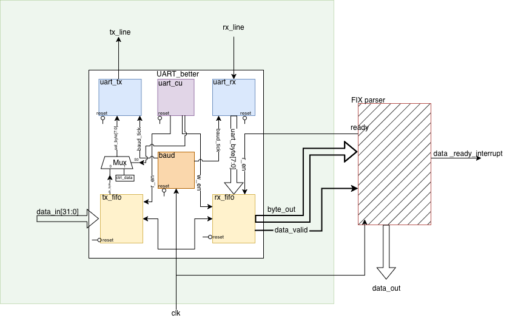
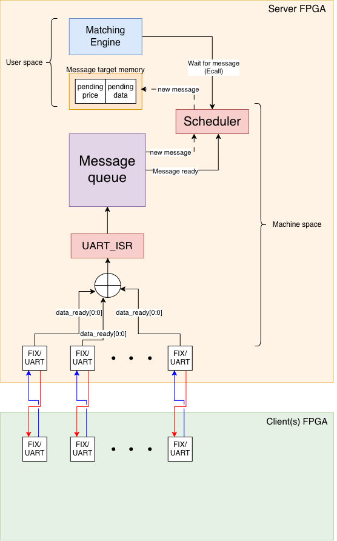

# minfix

A low-latency, memory-mapped FIX parser with a **UART communication peripheral** using hardware-side
message framing, flow control, and error detection, integrated with an
**interrupt-driven, multiprocessing operating system** on a RISC-V-based SoC. The
system implements a client/server electronic-trading scenario: multiple client
boards stream **FIX** orders to a server board running a matching engine.

---

## Design goals

The peripheral moves serialization, framing, flow control, and error detection into
RTL, so the CPU is interrupted only when a complete, parsed message is ready. Two
priorities drove the design: keeping the wire-to-application path deterministic and
low-latency, and keeping the messaging layer robust under burst load.

---

## System architecture


*Figure 1 — RTL block diagram of the communication peripheral (`UART_better`).*


*Figure 2 — Client/server integration: multiple FIX/UART links feeding an
interrupt-driven OS, message queue, scheduler, and matching engine.*

### RTL module hierarchy (`UART_better`)

| Module | Role |
|---|---|
| `uart_tx` | Serializes and drives the transmit line, with parity + framing |
| `uart_rx` | Samples the receive line, recovers bytes, checks parity/framing |
| `uart_cu` | Control unit — drives all internal enables/data-select without software help |
| `baud` | Baud-rate generation |
| `tx_fifo` | Word-in / byte-out transmit buffer (`data_in[31:0]`) |
| `rx_fifo` | Byte buffer feeding the FIX parser (`byte_out`, `data_valid`) |
| `Mux` | Selects between payload data and control characters (`ctrl_data`) |

Each communication link terminates in a **FIX parser**, which raises
`data_ready_interrupt` only once a complete, valid message has been assembled,
removing the need to buffer whole messages in the CPU-visible FIFO.

---

## Key design features

### Minimal software intervention on the datapath
- The transmit FIFO is **written in 32-bit words but serialized to bytes in
  hardware**, so enqueuing a word for transmission costs a single store to a mapped
  address — one memory write per word, not per byte.
- The control unit sets all internal enable/select signals autonomously. Once data
  is present and a **Start-of-Text (STX)** control character is seen, bytes stream
  out with no further CPU involvement.
- On **End-of-Transmission (EOT)**, the control character is sent, `data_valid` is
  deasserted, and the line idles until the next STX. Anything written between EOT
  and the next STX is treated as invalid and dropped; framing is enforced in
  hardware.

### Robustness / flow control
- **X-On / X-Off software flow control.** When the receive FIFO fills, the control
  unit switches the transmit mux to `ctrl_data` and emits an X-Off; a received
  X-Off halts the local transmitter, giving the far-end RX FIFO time to drain. This
  is the primary mechanism for avoiding packet loss under burst load.
- **Even-parity error detection.** Each byte is checked for even parity of 1s; a
  mismatch invalidates the byte and raises a parity-error flag.
- **Frame-error detection.** A UART line is expected to return high after a
  transmission; failure to do so flags a malformed data frame via `data_error`.

### Memory-mapped software interface
- The peripheral exposes a word-addressable region **`0x0002_0000 → 0x0002_003F`**.
  Each word address maps to a distinct transmitter — writing to a different address
  sends data over a different physical pin, giving up to 16 independent transmit
  channels through a flat, register-like interface.
- A **network library** wraps a null-terminated string into a wire message: it
  prepends STX and replaces the null terminator with EOT, so application code does
  not touch framing directly.

### Interrupt-driven message handling
- When a parser signals a complete message, the ISR disambiguates the source by
  reading a control register whose lower halfword is a bit-per-parser interrupt
  bitmap. Multiple simultaneous interrupts are serviced in turn, and each is
  cleared by writing back to the corresponding parser's control register.
- A completed message is dequeued from the message queue and its owning process is
  rescheduled. A process can also request notification via **`ECALL`** and **block**
  while waiting, freeing the CPU for other work until its message arrives (at most
  one process waits at a time).

### Multiprocessing scheduler
- The scheduler supports up to **17 processes** (16 client processes + 1 init), with
  clients sleeping at intervals to rate-limit outgoing orders.

---

## Design evolution

An earlier iteration used **double / ping-pong buffering** in the receive FIFO, so
two full messages could accumulate before the buffer filled, with an interrupt
raised per completed message. Streaming bytes directly into the hardware FIX parser
made whole-message CPU-side buffering unnecessary and shortened the receive path.

---

## Tech stack

- **RTL:** Verilog/SystemVerilog (UART TX/RX, control unit, baud generator, FIFOs)
- **Target:** RISC-V-based SoC with memory-mapped I/O, user/machine privilege modes,
  and `ECALL`-based system calls
- **Software:** low-level C / assembly — ISR, memory-mapped driver, network library,
  scheduler integration
- **Protocol:** UART framing with STX/EOT control characters; FIX application layer

---

## Known limitations & future work

- **No retransmission.** Parity and frame errors are detected and flagged, but
  ACK/NACK-based retry is not implemented. A lightweight ARQ layer on top of the
  existing error flags is the next step.
- **Scheduler not fully integrated.** Multiprocessing was proven separately but is
  not yet connected to the final user-space application.
- **Observability.** Distinguishing software mis-access of the peripheral from RTL
  bugs was a recurring debug cost. Additional status registers and assertions at the
  hardware/software boundary would make future integration faster.

---

## Repository layout / images

The diagrams above are referenced from a `docs/` folder:

```
docs/
  uart-system-diagram.png     # Figure 1
  system-integration.png      # Figure 2
```
